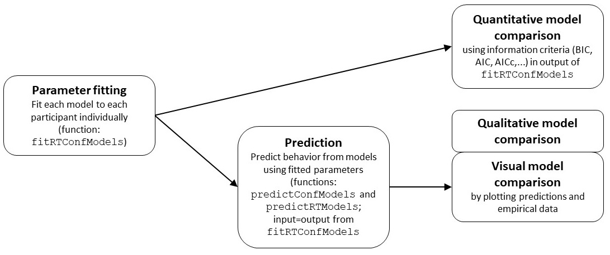

<!-- badges: start -->

[](https://app.codecov.io/gh/SeHellmann/dynConfiR?branch=main)

<!-- badges: end -->

# dynConfiR: R package for sequential sampling models of decision confidence

This package includes implementation for several sequential sampling
models of decision making and confidence judgments. The package includes
density functions for decision, confidence and response time outcomes
for following models: Dynamic visibility, time, and evidence model
(dynaViTE), Dynamic weighted evidence and visibility (dynWEV), two-stage
signal detection (2DSD), inpedendent and partially-correlated race
models (IRM/PCRM). In addition, the package includes functions for
parameter fitting, prediction and simulation of data. See the Preprint
(Hellmann et al., 2025) for more information about implemented models
and usage.

## Installation

The latest released version of the package is available on CRAN via

`install.packages("dynConfiR")`

For the current development version, the easiest way of installation is
using `devtools` and install from GitHub:

    devtools::install_github("SeHellmann/dynConfiR")

## Usage

### Density functions

``` r
library(dynConfiR)
d2DSD(rt=0.7, th1=1, th2=2.5, response="lower", 
      a=2, v=0.7, t0=0, z =0.5, sv=0, st0=0.1, tau=1, lambda=0.5)
```

    ## [1] 0.02387657

``` r
ddynaViTE(rt=2.7, th1=1, th2=2.5, response="lower", 
      tau=1, a=2, v=0.7, t0=0, z =0.5, sv=0, st0=0.1, lambda=0.2,
     simult_conf = TRUE)
```

    ## [1] 0.01437747

``` r
dIRM(1.2, response=2, mu1=0.5, mu2=-0.5, a=0.8, b=0.5, th1=-0.5, th2=2, 
     wx=0.5, wrt=0.2, wint=0.3, t0=0.3, st0=0.2)
```

    ## [1] 0.07616836

``` r
dPCRM(1.2, response=2, mu1=0.5, mu2=-0.5, a=0.8, b=0.5, th1=-0.5, th2=2, 
     wx=0.5, wrt=0.2, wint=0.3, t0=0.3, st0=0.2)
```

    ## [1] 0.0834613

## Workflow for data analysis

When using the package for model comparison, the suggested workflow is:

<figure>

<figcaption aria-hidden="true">Package workflow for model
comparison</figcaption>
</figure>

Data should be of the form

``` r
head(data)
```

    ##   participant direction coherence response   rt rating
    ## 1           1      left       0.3     left 1.21      2
    ## 2           1      left       0.5     left 1.09      3
    ## 3           1     right       0.3     left 0.97      2
    ## 4           1     right       0.5     left 1.45      1
    ## 5           1      left       0.1    right 1.22      1

where the task may have been to discriminate `direction` and `coherence`
was manipulated for higher or lower accuracy. Fitting confidence models
requires the data to be in a `data.frame` or `tibble` object with
columns for following variables:

- stimulus: In a binary decision task the stimulus identity gives the
  correct response
- condition: The experimental manipulation that is expected to affect
  model parameters should be present
- response: The actual decision in the choice task
- rt: The recorded response time.
- rating: A discrete variable encoding the decision confidence (high:
  very confident; low: less confident)

Alternatively to `stimulus` or `response` it is possible to use a
column, `correct`, representing whether the decision was correct or
wrong. Alternative column names may be passed to the fitting functions
(see below).

### Fitting

If there are several participants, for which the models should be fitted
independently, and the models of interest are dynWEV and 2DSD, then
fitting the models is done using the `fitRTConfModels` function:

    fitted_pars <- fitRTConfModels(data, models=c("dynWEV","2DSD"), stimulus="direction", condition="coherence")

By default, this parallelizes the fitting process over participant-model
combinations. The output is then a data frame with one row for each
participant-model combination and columns for parameters and measures
for model performance (negative log-likelihood, BIC, AIC and AICc).
These may be used for quantitative model comparison.

``` r
head(fitted_pars)
```

    ##    participant model    a    z   sz   v1   v2   v3   sv   t0  st0 thetaLower1
    ## 1            1  2DSD 1.90 0.35 0.35 0.01 0.00 2.14 0.18 0.24 0.45       -1.29
    ## 21           3  2DSD 2.53 0.39 0.16 0.00 0.02 1.02 0.54 0.33 0.22       -0.95
    ## 28           4  2DSD 1.70 0.43 0.62 0.00 0.01 2.05 0.00 0.33 0.33       -1.82
    ## 29           5  2DSD 1.94 0.43 0.00 0.00 0.83 3.34 0.60 0.33 0.09       -1.76
    ## 30           6  2DSD 1.33 0.51 0.51 0.00 0.01 2.27 0.81 0.38 0.35       -1.70
    ## 31           7  2DSD 1.67 0.74 0.47 0.03 0.01 3.49 0.26 0.34 0.58       -1.92
    ##    thetaLower2 thetaUpper1 thetaUpper2 tau negLogLik   N  k     BIC    AICc
    ## 1        -0.90        2.15        2.19   1   1019.23 527 20 2163.80 2079.96
    ## 21       -0.73        2.63        2.71   1   1475.68 534 20 3076.97 2992.84
    ## 28       -1.60        1.58        1.79   1    967.71 533 20 2060.99 1976.90
    ## 29       -1.41        2.96        3.20   1    741.86 536 20 1609.41 1525.20
    ## 30       -1.41        1.75        2.13   1    911.06 531 20 1947.62 1863.61
    ## 31        0.05        3.09        3.09   1    647.34 533 20 1420.25 1336.17
    ##        AIC  w sig sigmu
    ## 1  2078.45 NA  NA    NA
    ## 21 2991.36 NA  NA    NA
    ## 28 1975.42 NA  NA    NA
    ## 29 1523.72 NA  NA    NA
    ## 30 1862.12 NA  NA    NA
    ## 31 1334.68 NA  NA    NA

### Prediction

For prediction the functions `predictConf` and `predictRT` are used,
together with parameter sets for the respective models. For multiple
participants and models, the output data frame from the function
`fitRTConfModels` may be used in the functions `predictConfModels` and
`predictRTModels` to simultaneously (and in parallel) predict the
distributions.

- `predictConf`: This function predicts the distribution of decision and
  rating responses (ignoring response times) for the different stimulus
  conditions.
- `predictRT`: This function computes the probability densities for
  decision, confidence and response time outputs over a range of
  response times for different stimulus conditions. If required, it also
  returns a scaled density (i.e. the conditional probability of a
  certain response time, given the decision and confidence response) -
  for this the output of `predictConf` is required.

**Usage example:**

    fitted_pars %>% 
      group_by(model, participant) %>% 
      summarise(predictConf(pick(everything()), model=cur_group()$model[1]))

## Further functions

Implementation of a simulation of observations in the Leaky Competing
Accumulator model (see `rLCA`).

# Contributing to the package

The package is under active development. We are planning to implement
new models of decision confidence when they are published. Please feel
free to [contact us](mailto:sebastian.hellmann@tum.de) to suggest new
models to implement in the package, or to volunteer adding additional
models.

**Implementing custom models of decision confidence is only recommended
for users with experience in cognitive modelling!** For readers who want
to use our open code to implement models of confidence themselves, the
following steps need to be taken:

- Derive the likelihood of a binary response ($R=-1, 1$) at response
  time ($T$) and a specific level of confidence ($C=1,...K$) according
  to the custom model and a set of parameters ($\theta$), given the
  binary stimulus ($S=-1, 1$), i.e. $P(R, T, C | S, \theta)$.
- Write a corresponding density function ‘d*yourmodelname*’ based on the
  available densities.
- Use one of the files named ‘likelihood\_*model*.R’ from the package
  sources and adapt the likelihood function according to your model.
  According to our convention, name the new file a
  ‘likelihood\_*yourmodelname*.R’.
- Use one of the files ‘int_fitting\_*model*.R’ from the package sources
  and adapt the fitting function to reflect the new model.
  - The initial grid used during the grid search should include a
    plausible range of all parameters of your model.
  - If you want to use a Nelder-Mead algorithm, constraint parameters of
    the initial grid need be transformed so the parameter vector for
    optimization is real-valued).
  - If applicable, the parameter vector i obtained during optimization
    needs to back-transformation for the the output object `res`.
  - Name the new file according to the convention
    ‘int_fitting\_*yourmodelname*.R’.
- Add your model and fitting-functions to the high-level functions
  `fitRTConf` and `fitRTConfModels`.
- Add prediction functions for your model based on one of the files
  ‘predictratingdist\_*model*.R’. The file should include a function for
  computing the discrete rating distribution ‘predict*yourmodel*\_Conf’
  and a function computing the density across a range of response times
  ‘predict*yourmodel*\_RT’.
- Add your prediction function to the high-level functions
  `predictConf`/`predictConfModels`, and `predictRT`/`predictRTModels`.
- Optional: Add simulation functions for your model based on one of the
  files ‘simulate*model*.R’

## References

Hellmann, S., Zehetleitner, M., & Rausch, M. (2023). Simultaneous
modeling of choice, confidence, and response time in visual perception.
Psychological Review, 130(6), 1521–1543. doi:
[10.1037/rev0000411](https://doi.org/10.1037/rev0000411)

Hellmann, S., Zehetleitner, M. & Rausch, M. (2024). Confidence Is
Influenced by Evidence Accumulation Time in Dynamical Decision Models.
Comput Brain Behav 7, 287–313. doi:
[10.1007/s42113-024-00205-9](https://doi.org/10.1007/s42113-024-00205-9)

## Contact

For comments, remarks, and questions please contact me:
<sebastian.hellmann@ku.de> or [submit an
issue](https://github.com/SeHellmann/dynConfiR/issues).
