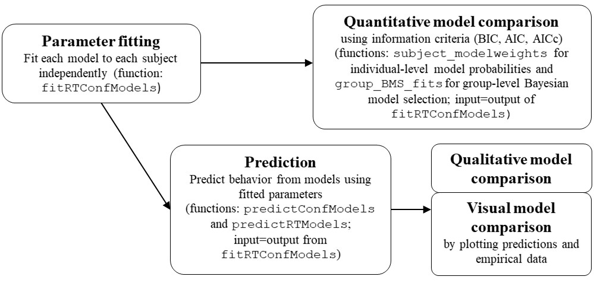

```{r setup,echo=FALSE,message=FALSE}
#library(jpeg)
knitr::opts_chunk$set(echo = TRUE)
#gitsubdir <- paste(tail(strsplit(getwd(),"/")[[1]],1),"/",sep="")
#gitrep <- "https://github.com/SeHellmann/myliuduomenis.lt"
gitrep <- "https://github.com/SeHellmann/dynConfiR/tree"
gitbranch <- "main/"
#knitr::opts_knit$set(base.url=paste(gitrep,gitbranch,gitsubdir,sep="/"))
knitr::opts_knit$set(base.url=paste(gitrep,gitbranch, sep="/"))
```

# dynConfiR: R package for sequential sampling models of decision confidence

This package includes implementation for several sequential sampling models of decision making and confidence judgments. Functionality includes density functions for decision, confidence and response time outcomes as well as functions for parameter fitting, prediction and simulation.

## Installation

So far, the easiest way of installation is using `devtools` and install from GitHub:

    devtools::install_github("SeHellmann/dynConfiR")

Publication on the CRAN repository is in progress.

## Usage

### Density functions

```{r}
library(dynConfiR)
d2DSD(rt=0.7, th1=2.4, th2=2.5, response="lower", 
      tau=1, a=2, v=0.7, t0=0, z =0.5, sv=0, st0=0.1)
dWEV(rt=0.7, th1=2.4, th2=2.5, response="lower", 
      tau=1, a=2, v=0.7, t0=0, z =0.5, sv=0, st0=0.1)

```

## Workflow for data analysis

When using the package for model comparison, the suggested workflow is:

```{r, echo=FALSE, out.width="80%"}
# workflow_img <- "README_files/Workflow.jpg"
# include_graphics(workflow_img)
#![Workflow for model comparison][README_files/Workflow.jpg?raw=true]
```



Data should be of the form

```{r, echo=FALSE}
data <- data.frame(participant = c(1,1,1,1,1),
                   direction = c("left", "left", "right", "right", "left"),
                   coherence = c(0.3, 0.5, 0.3, 0.5, 0.1),
                   response = c("left", "left", "left", "left", "right"),
                   rt = c(1.21, 1.09, 0.97, 1.45, 1.22),
                   rating = c(2, 3, 2, 1, 1))
```

```{r}
head(data)
```

where the task may have been to discriminate `direction` and `coherence` was manipulated for higher or lower accuracy. Fitting confidence models requires the data to be in a data.frame or tibble object with columns for following variables:

-   stimulus: In a binary decision task the stimulus identity gives the correct response
-   condition: The experimental manipulation that is expected to affect model parameters should be present
-   response: The actual decision in the choice task
-   rt: The recorded response time.
-   rating: A discrete variable encoding the decision confidence (high: very confident; low: less confident)

Alternatively to `stimulus` or `response` it is possible to use a column, `correct`, representing whether the decision was correct or wrong. Alternative column names may be passed to the fitting functions (see below).

### Fitting

If there are several participants, for which the models should be fitted independently, and the models of interest are dynWEV and 2DSD, then fitting the models is done using the `fitRTConfModels` function:

    fitted_pars <- fitRTConfModels(data, models=c("dynWEV","2DSD"), stimulus="direction", condition="coherence")

By default, this parallelizes the fitting process over participant-model combinations. The output is then a data frame with one row for each participant-model combination and columns for parameters and measures for model performance (negative log likelihood, BIC, AIC and AICc). These may be used for quantitative model comparison.

```{r, echo=FALSE}
fitted_pars <- structure(list(participant = c(1, 3, 4, 5, 6, 7), model = c("2DSD", 
"2DSD", "2DSD", "2DSD", "2DSD", "2DSD"), a = c(1.9, 2.53, 1.7, 
1.94, 1.33, 1.67), z = c(0.35, 0.39, 0.43, 0.43, 0.51, 0.74), 
    sz = c(0.35, 0.16, 0.62, 0, 0.51, 0.47), v1 = c(0.01, 0, 
    0, 0, 0, 0.03), v2 = c(0, 0.02, 0.01, 0.83, 0.01, 0.01), 
    v3 = c(2.14, 1.02, 2.05, 3.34, 2.27, 3.49), sv = c(0.18, 
    0.54, 0, 0.6, 0.81, 0.26), t0 = c(0.24, 0.33, 0.33, 0.33, 
    0.38, 0.34), st0 = c(0.45, 0.22, 0.33, 0.09, 0.35, 0.58), 
    thetaLower1 = c(-1.29, -0.95, -1.82, -1.76, -1.7, -1.92), 
    thetaLower2 = c(-0.9, -0.73, -1.6, -1.41, -1.41, 0.05), thetaUpper1 = c(2.15, 
    2.63, 1.58, 2.96, 1.75, 3.09), thetaUpper2 = c(2.19, 2.71, 
    1.79, 3.2, 2.13, 3.09), tau = c(1, 1, 1, 1, 1, 1), negLogLik = c(1019.23, 
    1475.68, 967.71, 741.86, 911.06, 647.34), N = c(527, 534, 
    533, 536, 531, 533), k = c(20, 20, 20, 20, 20, 20), BIC = c(2163.8, 
    3076.97, 2060.99, 1609.41, 1947.62, 1420.25), AICc = c(2079.96, 
    2992.84, 1976.9, 1525.2, 1863.61, 1336.17), AIC = c(2078.45, 
    2991.36, 1975.42, 1523.72, 1862.12, 1334.68), w = c(NA_real_, 
    NA_real_, NA_real_, NA_real_, NA_real_, NA_real_), sig = c(NA_real_, 
    NA_real_, NA_real_, NA_real_, NA_real_, NA_real_), sigmu = c(NA_real_, 
    NA_real_, NA_real_, NA_real_, NA_real_, NA_real_)), row.names = c(1L, 
21L, 28L, 29L, 30L, 31L), class = "data.frame")
```

```{r}
head(fitted_pars)
```

### Prediction

For prediction the functions `predictConf` and `predictRT` are used, together with parameter sets for the respective models. For multiple participants and models, the output data frame from the function `fitRTConfModels` may be used in the functions `predictConfModels` and `predictRTModels` to simultaneously (and in parallel) predict the distributions.

-   `predictConf`: This function predicts the distribution of decision and rating responses (ignoring response times) for the different stimulus conditions.
-   `predictRT`: This function computes the probability densities for decision, confidence and response time outputs over a range of response times for different stimulus conditions. If required, it also returns a scaled density (i.e. the conditional probability of a certain response time, given the decision and confidence response) - for this the output of `predictConf` is required.

**Usage example:**

    fitted_pars %>% 
      group_by(model, participant) %>% 
      summarise(predictConf(cur_data_all(), model=cur_group()$model[1]))

## Further functions

Implementation of a simulation of observations in the Leaky Competing Accumulator model (see `rLCA`).

## Contact

For comments, remarks, and questions please contact me: [sebastian.hellmann\@ku.de](mailto:sebastian.hellmann@ku.de) or [submit an issue](https://github.com/SeHellmann/dynConfiR/issues).
