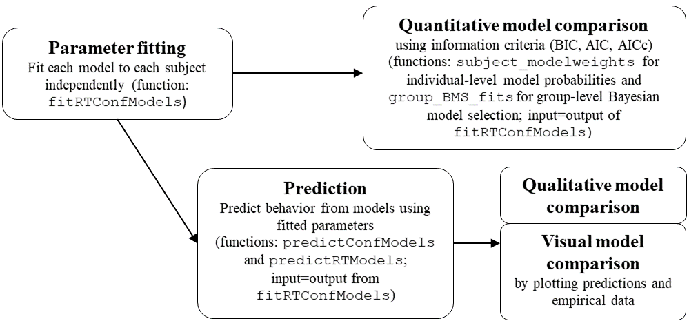

#### For dynConfiR version 1.0.0

This vignette illustrates the whole workflow for a modelling study using the `dynConfiR` package. 
A detailed description of the package and the implemented models can be found in Hellmann et al. (preprint).
The basic workflow of a modelling study is illustrated together with the respective functions implemented in the package in the following chart:

<div class="figure" style="text-align: center">

<p class="caption">Workflow of modeling study using dynConfiR</p>
</div>


```r
library(dynConfiR)
library(tidyverse)
#> ── Attaching core tidyverse packages ──────────────────────── tidyverse 2.0.0 ──
#> ✔ dplyr     1.1.4     ✔ readr     2.1.5
#> ✔ forcats   1.0.0     ✔ stringr   1.5.1
#> ✔ ggplot2   3.5.1     ✔ tibble    3.2.1
#> ✔ lubridate 1.9.3     ✔ tidyr     1.3.1
#> ✔ purrr     1.0.2     
#> ── Conflicts ────────────────────────────────────────── tidyverse_conflicts() ──
#> ✖ dplyr::filter() masks stats::filter()
#> ✖ dplyr::lag()    masks stats::lag()
#> ℹ Use the conflicted package (<http://conflicted.r-lib.org/>) to force all conflicts to become errors
```


## Step 0: Data preparation

For this illustration, we load the `ConfidenceOrientation` dataset, which is contained in the `dynConfiR` package.
The dataset contains results from an orientation discrimination experiment with simultaneous confidence judgments. The data set includes results from 16 participants and 3 sessions each. The task was to identify the orientation (horizontal ("waagrecht") or vertical ("senkrecht")) of a grid that was briefly visible and then covered by a mask in form of a checkerboard pattern. The stimulus-onset-asynchrony (SOA) was manipulated in 5 steps. Confidence was reported using a joystick on a continuous visual analogue scale with values between -1 and 1. 


```r
data("ConfidenceOrientation")
data <- ConfidenceOrientation %>%
  select(participant, SOA, stimulus, response, correct, rt, cont_rating)
head(ConfidenceOrientation)
#> # A tibble: 6 × 12
#>   participant session gender   age   SOA orientation stimulus  response  correct
#>         <dbl>   <dbl> <chr>  <dbl> <dbl>       <dbl> <chr>     <chr>       <dbl>
#> 1           1       1 w         23   8.3           0 senkrecht senkrecht       1
#> 2           1       1 w         23 133.           90 waagrecht senkrecht       0
#> 3           1       1 w         23  33.3           0 senkrecht senkrecht       1
#> 4           1       1 w         23  16.7          90 waagrecht senkrecht       0
#> 5           1       1 w         23 133.            0 senkrecht senkrecht       1
#> 6           1       1 w         23  16.7           0 senkrecht senkrecht       1
#> # ℹ 3 more variables: rt <dbl>, cont_rating <dbl>, disc_rating <dbl>
head(data)
#> # A tibble: 6 × 7
#>   participant   SOA stimulus  response  correct    rt cont_rating
#>         <dbl> <dbl> <chr>     <chr>       <dbl> <dbl>       <dbl>
#> 1           1   8.3 senkrecht senkrecht       1  2.89      -0.969
#> 2           1 133.  waagrecht senkrecht       0  3.06       0.817
#> 3           1  33.3 senkrecht senkrecht       1  2.83      -1    
#> 4           1  16.7 waagrecht senkrecht       0  2.65      -1    
#> 5           1 133.  senkrecht senkrecht       1  2.92       0.270
#> 6           1  16.7 senkrecht senkrecht       1  3.17      -0.992
```
There are several steps of data preparation, which are either necessary or recommended. 
First, the models implemented in `dynConfiR` all require confidence to be measured on a discrete scale, so we discretize the contionuous confidence rating. We do this using equidistant breaks. The functions would be fine with any integer or factor column, so we simply use the cut function.  


```r
data <- data %>%
  mutate(confidence = cut(cont_rating, breaks = seq(-1, 1, length.out=6), include.lowest = TRUE,
                          labels=1:5))
head(data)
#> # A tibble: 6 × 8
#>   participant   SOA stimulus  response  correct    rt cont_rating confidence
#>         <dbl> <dbl> <chr>     <chr>       <dbl> <dbl>       <dbl> <fct>     
#> 1           1   8.3 senkrecht senkrecht       1  2.89      -0.969 1         
#> 2           1 133.  waagrecht senkrecht       0  3.06       0.817 5         
#> 3           1  33.3 senkrecht senkrecht       1  2.83      -1     1         
#> 4           1  16.7 waagrecht senkrecht       0  2.65      -1     1         
#> 5           1 133.  senkrecht senkrecht       1  2.92       0.270 4         
#> 6           1  16.7 senkrecht senkrecht       1  3.17      -0.992 1
```
Second, it is recommended to exclude trials with very fast and slow response times. We do this using a sharp threshold of 300ms for fast response times and an individual upper threshold for each participant equal to the mean plus three times standard deviation. 
In addition, we exclude participants that showed guessing-level performance in the identification judgment, defined by the critical threshold of a binomial test. Finally, we exclude participants, which showed no variation in their confidence judgments, defined by reporting the same discrete confidence in at least 90% of the trials.

```r
### Exclusion of participants
exclusion_crit <- data %>% group_by(participant) %>%
  reframe(bad_performance = binom.test(sum(correct), n(), p=0.5, alternative="greater")$p.value,
          prob_mode_conf = max(table(confidence))/n()) %>%
  mutate(bad_performance = bad_performance > 0.05, 
         no_conf_variation = prob_mode_conf>.90)
print(t(exclusion_crit))
#>                        [,1]      [,2]      [,3]      [,4]      [,5]      [,6]
#> participant       1.0000000 2.0000000 3.0000000 4.0000000 5.0000000 6.0000000
#> bad_performance   0.0000000 0.0000000 0.0000000 0.0000000 0.0000000 0.0000000
#> prob_mode_conf    0.4092593 0.4277778 0.5709877 0.5425926 0.5290123 0.3641975
#> no_conf_variation 0.0000000 0.0000000 0.0000000 0.0000000 0.0000000 0.0000000
#>                        [,7]      [,8]      [,9]     [,10]      [,11]      [,12]
#> participant       7.0000000 8.0000000 9.0000000 10.000000 11.0000000 12.0000000
#> bad_performance   0.0000000 0.0000000 0.0000000  0.000000  0.0000000  0.0000000
#> prob_mode_conf    0.5246914 0.4981481 0.3641975  0.795679  0.6259259  0.4759259
#> no_conf_variation 0.0000000 0.0000000 0.0000000  0.000000  0.0000000  0.0000000
#>                        [,13]      [,14]      [,15]      [,16]
#> participant       13.0000000 14.0000000 15.0000000 16.0000000
#> bad_performance    0.0000000  0.0000000  0.0000000  0.0000000
#> prob_mode_conf     0.6006173  0.4037037  0.4432099  0.5401235
#> no_conf_variation  0.0000000  0.0000000  0.0000000  0.0000000
excluded_parts <- exclusion_crit %>% filter(bad_performance | no_conf_variation) %>% 
  pull(participant)
data <- data %>% filter(!participant %in% excluded_parts)
### Result: No participant was excluded

### Exclusion of trials:
nrow_tot <- nrow(data)
data <- data %>% group_by(participant) %>% 
  filter((rt > 0.3) & (rt <mean(rt)+3*sd(rt)))
cat("We excluded ", 1- nrow(data)/nrow_tot, " of all trials because of RT's.\n")
#> We excluded  0.01296296  of all trials because of RT's.
```


*************************************


## Step 1: Parameter fitting 

The fitting function expects the data to come in a tidy data frame, with each row representing one trial. The data frame should include the following columns (expected column names in parentheses): true stimulus identity (`stimulus`), binary decision response (`response`), categorical confidence judgment (`rating`), and response time (`rt`). As an alternative to the stimulus or response column, a column for accuracy (`correct`) may be provided. 
In addition, a column for the experimental manipulation of discriminability of the stimulus (`condition`) may be included, which is the SOA in our example.
The columns `stimulus` and `response` should have the same possible values ("senkrecht" and "waagrecht" in our case). 
Instead of renaming columns in the data frame, alternative column names may be added as arguments of the form `rating = "confidence"`, to tell the function that the confidence rating is contained in the column `confidence`. Similarly, we add the argument `condition="SOA"` to identify the column that represents our experimental manipulation. 
Any column named `sbj`, `subject`, or `participant` will be used to fit the models independently to individual subjects. 

Provided the data is prepared in such a format the desired models may be fitted to the data with one simple function call to `fitRTConfModels`. There are some possible specifications in the fitting procedure, like using only the single best parameter set (identified by a grid_search) using `nAttempts=1` and only one optimization call (`nRestarts=1`) to speed up the model fitting.
For diffusion-based models, the argument `restr_tau="simult_conf"` tells the function that the amount of post-decisional evidence accumulation should be naturally bound by the empirical response time, since confidence was reported simultaneously with the identification judgment. 

In the following code, we comment the actual fitting call and load pre-fitted parameters, because the fitting would take some time (about 1.5 hours on a 2.4GHz processor, given there are 20 cores available). 


```r
# parfits <- fitRTConfModels(data, models=c("2DSD", "IRMt"), 
#                            restr_tau = "simult_conf", 
#                            opts = list(nAttempts=1, nRestarts=1), 
#                            logging = FALSE, 
#                            parallel="models", n.cores = 20,
#                            condition="SOA", rating="confidence")
# save(parfits, file="saved_parfits.RData")
load("ressources/saved_parfits.RData")
head(parfits)
#>      model negLogLik    N  k      BIC     AICc      AIC
#> 1 dynaViTE  3423.288 1587 24 7023.447 6895.283 6894.576
#> 2     2DSD  3566.387 1587 20 7280.166 7173.259 7172.774
#> 3     IRMt  3756.845 1587 19 7653.712 7552.126 7551.690
#> 4 dynaViTE  2833.633 1601 24 5844.348 5715.967 5715.266
#> 5     2DSD  3005.796 1601 21 6166.537 6054.123 6053.591
#> 6     IRMt  3152.874 1601 19 6445.937 6344.180 6343.748
#>                        fixed        t0       st0         v1         v2
#> 1           sym_thetas=FALSE 1.3424692 0.9359015 0.18269770 0.39655533
#> 2 sym_thetas=FALSE, lambda=0 0.0000000 0.9424488 0.01871128 0.21913645
#> 3           sym_thetas=FALSE 1.4305597 1.0771606 0.01381402 0.25913446
#> 4           sym_thetas=FALSE 0.0000000 1.2528076 0.06839356 0.29952115
#> 5 sym_thetas=FALSE, lambda=0 0.8677412 1.0621247 0.17089625 0.06500952
#> 6           sym_thetas=FALSE 1.4080804 1.5808275 0.03986083 0.21061357
#>          v3        v4       v5 thetaLower1 thetaLower2 thetaLower3  thetaLower4
#> 1 0.6972138 2.0676742 2.367748   0.5319406   0.7244282    1.052593 1.356565e+00
#> 2 0.5285474 1.7837465 2.285297   0.2457220   0.8414821    1.804069 2.640370e+00
#> 3 0.5684356 1.9681446 2.285918   0.8107486   1.0434087    1.467859 1.875711e+00
#> 4 0.5049240 1.1211837 1.427827   1.5183670   1.7745036    2.010324 1.000000e+24
#> 5 0.3130298 0.9364188 1.809277   2.1704956   2.6941202    3.114510 1.000000e+24
#> 6 0.4045930 1.1478456 2.459388   2.5641551   3.1989347    3.899690 1.000000e+24
#>   thetaUpper1 thetaUpper2 thetaUpper3  thetaUpper4        wrt      wint
#> 1   0.2439791   0.5182875    0.992385 1.316834e+00         NA        NA
#> 2  -0.5129848   0.3566307    1.756024 2.661897e+00         NA        NA
#> 3   0.8384092   1.2394523    2.026483 2.568221e+00 0.06619651 0.9338035
#> 4   1.4258496   1.6555371    1.901753 1.000000e+24         NA        NA
#> 5   2.0613721   2.5446263    2.887283 1.000000e+24         NA        NA
#> 6   2.4926748   2.9529658    3.601922 1.000000e+24 0.00000000 0.8425240
#>         wx         b         a         z           sz         sv       tau
#> 1       NA        NA 1.7443862 0.5932128 3.956088e-01 0.84324524 0.1123153
#> 2       NA        NA 1.6865064 0.5916077 1.481742e-06 0.66848076 1.4331155
#> 3 0.000000 0.5886599 0.7630233        NA           NA         NA        NA
#> 4       NA        NA 1.7026228 0.5128777 7.930835e-01 0.00149642 1.4352690
#> 5       NA        NA 1.9316822 0.5116397 9.349912e-01 0.24087906 0.6161631
#> 6 0.157476 0.5331864 0.5520089        NA           NA         NA        NA
#>           w         svis    sigvis    lambda participant
#> 1 0.4829751 1.154609e-06 0.7349314 0.6103222           1
#> 2        NA           NA        NA 0.0000000           1
#> 3        NA           NA        NA        NA           1
#> 4 0.2182938 1.732596e-02 0.2311835 0.7750507          10
#> 5        NA           NA        NA 0.0000000          10
#> 6        NA           NA        NA        NA          10
```

We can also include parameter restrictions into our models using the `fixed` argument. For example, the starting point can be fixed to 0.5 to implement the assumption of unbiased observers. For race models (IRMt and PCRMt), this would be included by specifying that the response thresholds for both accumulators should be equal (`a="b"`). For unbiased observers, it may be reasonable to assume that the confidence thresholds for both responses coincide (`sym_thetas=TRUE`). Also, the between-trial variabilities of non-decision time and starting point may be set to 0 (which leads to much faster fitting). 

```r
# parfits_restricted <- fitRTConfModels(data, models=c("dynaViTE", "2DSD"), 
#                            restr_tau = "simult_conf", 
#                            fixed = list(sym_thetas=TRUE, z=0.5, sz=0, st0=0), 
#                            opts = list(nAttempts=1, nRestarts=1), 
#                            logging = FALSE, 
#                            parallel="models", n.cores = 20,
#                            condition="SOA", rating="confidence")
# save(parfits_restricted, file="saved_parfits_restricted.RData")
load("ressources/saved_parfits_restricted.RData")
parfits_restricted$model <-  paste0(parfits_restricted$model, "_restricted")
head(parfits_restricted)
#>                 model negLogLik    N  k      BIC     AICc      AIC
#> 1 dynaViTE_restricted  3782.012 1587 17 7689.308 7598.371 7598.024
#> 2     2DSD_restricted  3927.596 1587 13 7950.998 7881.391 7881.193
#> 3 dynaViTE_restricted  3104.807 1601 17 6335.046 6243.957 6243.613
#> 4     2DSD_restricted  3282.036 1601 13 6659.991 6590.269 6590.072
#> 5 dynaViTE_restricted  3145.554 1602 17 6416.552 6325.452 6325.109
#> 6     2DSD_restricted  3591.284 1602 13 7278.495 7208.765 7208.568
#>                                           fixed        t0 st0          v1
#> 1           sym_thetas=TRUE, z=0.5, sz=0, st0=0 0.9769269   0 0.104220678
#> 2 sym_thetas=TRUE, z=0.5, sz=0, st0=0, lambda=0 0.0000000   0 0.004605967
#> 3           sym_thetas=TRUE, z=0.5, sz=0, st0=0 0.0000000   0 0.051849765
#> 4 sym_thetas=TRUE, z=0.5, sz=0, st0=0, lambda=0 0.0000000   0 0.032984315
#> 5           sym_thetas=TRUE, z=0.5, sz=0, st0=0 0.0000000   0 0.000000000
#> 6 sym_thetas=TRUE, z=0.5, sz=0, st0=0, lambda=0 0.0000000   0 0.025194867
#>          v2        v3        v4        v5       theta1    theta2    theta3
#> 1 0.2274269 0.3946561 1.0985194 1.2429055  0.203665481 0.4060153 0.7559468
#> 2 0.1472463 0.3580550 1.1412923 1.3908756 -0.004910317 0.5852685 1.5533554
#> 3 0.1693557 0.3216821 0.6569603 0.8039947  0.957901992 1.0780363 1.1971126
#> 4 0.1069910 0.2163189 0.6577729 1.2179978  2.882317755 3.6263226 4.4925305
#> 5 0.0000000 0.1097628 0.4804683 0.8395739  0.321829888 0.4251862 0.5035269
#> 6 0.0000000 0.0000000 0.5820335 1.3844089  1.890613073 2.2985357 2.6199404
#>         theta4        a   z sz           sv       tau          w         svis
#> 1 1.014019e+00 2.308885 0.5  0 1.593695e-06 0.4740562 0.41781718 1.000000e-06
#> 2 2.233444e+00 2.321753 0.5  0 4.945559e-06 1.4519430         NA           NA
#> 3 1.000000e+24 2.346478 0.5  0 1.230765e-06 1.4024472 0.19285450 1.000000e-06
#> 4 1.000000e+24 2.377583 0.5  0 0.000000e+00 1.4057496         NA           NA
#> 5 6.588504e-01 2.046277 0.5  0 9.477280e-07 1.3960523 0.08876062 5.945011e-06
#> 6 3.351139e+00 2.082824 0.5  0 0.000000e+00 1.3993972         NA           NA
#>       sigvis    lambda participant
#> 1 0.43166559 0.5964927           1
#> 2         NA 0.0000000           1
#> 3 0.07597196 0.7374815          10
#> 4         NA 0.0000000          10
#> 5 0.17308645 1.1844435          11
#> 6         NA 0.0000000          11
```

## Step 2: Quantitative model comparison
Quantitative model comparison are often based on difference in information criteria, like BIC and AIC. The package includes two important functions to compare the model fits quantitatively. 
First, on an individual level, one may compute model weights based on information criteria, using the function `subject_modelweights`. This allows to investigate individual variability in group comparisons or studies about individual differences. It would also be possible to calculate individual Bayes Factors, which is sometimes easier to interpret. 

Second, to calculate group averages, the function `group_BMS_fits` performs a Bayesian model selection based on a random effects model on model weights (see Dauzineau et al., 2014, for more detail). 
The function also provides the output of a fixed effects model, which is equivalent to adding up individual BIC differences (or multiplying individual Bayes Factors), however, we recommend the random effects model weight. It is also possible to calculate Bayes Factors for a binary comparison using the output but as a comparison between two models, only, is rather seldom, the output is formatted for multiple models. 

In our example, we first visualize the BIC values across different models (with lines for each participant). We already see that the dynaViTE model has the lowest BIC for all participants and the IRMt performs worse. Then, we apply `subject_modelweights` function and visualize the individual model weights. This plot again shows that for each individual subject, the dynaViTE performs clearly better.  Accordingly, the protected exceedence probability (PEP) clearly favours the dynaViTE model in the group-level comparison. 


```r
all_parfits <- bind_rows(parfits, parfits_restricted)
ggplot(all_parfits, aes(x=model, y=BIC))+
  geom_violin()+geom_line(aes(group=participant))
```


```r

individual_weights <- subject_modelweights(all_parfits)
print(head(individual_weights))
#>           2DSD 2DSD_restricted dynaViTE dynaViTE_restricted          IRMt
#> 1 1.795365e-56   3.844859e-202        1       2.571276e-145 1.379280e-137
#> 2 6.185979e-71    8.501866e-96        1        1.345557e-16 4.959842e-210
#> 3 2.151030e-31   1.053002e-288        1       2.962021e-239 3.244526e-112
#> 4 9.873734e-60   1.296667e-116        1        1.372067e-31 1.612462e-208
#> 5 4.312211e-51    1.316465e-92        1        1.669803e-24 2.841928e-243
#> 6 3.239234e-46   5.120792e-123        1        6.288945e-67 1.385392e-158
#>   participant
#> 1           1
#> 2          10
#> 3          11
#> 4          12
#> 5          13
#> 6          14
individual_weights %>% pivot_longer(cols=1:5, names_to="Model", values_to="Model weight") %>% 
  ggplot(aes(x=as.factor(participant), y=`Model weight`, fill=Model))+
  geom_bar(stat="identity")
```


```r

group_weights <- group_BMS_fits(all_parfits)
print(head(group_weights$model_weights))
#>                     alpha          r     ep    pep fx_prob
#> 2DSD                    2 0.09523810 0.0001 0.0001       0
#> 2DSD_restricted         1 0.04761905 0.0000 0.0000       0
#> dynaViTE               16 0.76190476 0.9999 0.9999       1
#> dynaViTE_restricted     1 0.04761905 0.0000 0.0000       0
#> IRMt                    1 0.04761905 0.0000 0.0000       0
```

*************************************

## Step 3: Model Checks: Predictions and visual comparison

Checking whether the best-fitting model (or any other model) can actually account for the observed data is an important step in every modelling study. Sometimes, there is a particular data pattern that is at the core of the study, but even if not, we should always check, whether the model can sufficiently account for the key data patterns, e.g. the relationship between discriminability and confidence. 

Predictions on a group-level can be computed in two different ways. 
First, it is possible to aggregate the fitted parameters (using the mean oder median) first and then only compute predictions for these group-level parameters. However, we recommend the second way: Computing the predicted distributions for each individual with the respective parameters and then aggregate the predictions in the same way as the empirical data. We think that this will in general give more robust results, because computing the mean of parameters independently ignores possible interactions that these parameters could have on the outcomes. 

We can directly use the output of the fitting function to compute predictions for our fitted parameters for each individual using the function `predictConfModels` (for the discrete response distributions) and `predictRTModels` (for the response time density). 


```r
# predictedResponses <- 
#   predictConfModels(parfits, simult_conf = TRUE) 
# predictedRTdist <-
#   predictRTModels(parfits, maxrt=9, simult_conf=TRUE)
# save(predictedResponses, predictedRTdist, file="predictions.RData")
load("ressources/predictions.RData")
print(head(predictedResponses))
#>   condition stimulus response correct rating            p info          err
#> 1         1        1        1       1      1 0.1257439758   OK 1.319106e-05
#> 2         2        1        1       1      1 0.0950783463   OK 1.204739e-05
#> 3         3        1        1       1      1 0.0571920690   OK 1.048219e-05
#> 4         4        1        1       1      1 0.0016623426   OK 4.351961e-06
#> 5         5        1        1       1      1 0.0007121333   OK 3.246739e-06
#> 6         1       -1        1       0      1 0.1151017976   OK 1.362677e-05
#>      model participant
#> 1 dynaViTE           1
#> 2 dynaViTE           1
#> 3 dynaViTE           1
#> 4 dynaViTE           1
#> 5 dynaViTE           1
#> 6 dynaViTE           1
print(head(predictedRTdist))
#>   condition stimulus response correct rating         rt dens    model
#> 1         1        1        1       1      1 0.00000000    0 dynaViTE
#> 2         1        1        1       1      1 0.09090909    0 dynaViTE
#> 3         1        1        1       1      1 0.18181818    0 dynaViTE
#> 4         1        1        1       1      1 0.27272727    0 dynaViTE
#> 5         1        1        1       1      1 0.36363636    0 dynaViTE
#> 6         1        1        1       1      1 0.45454545    0 dynaViTE
#>   participant
#> 1           1
#> 2           1
#> 3           1
#> 4           1
#> 5           1
#> 6           1
```


The predicted distributions may be visually compared to the empirical distributions to check how accurately the model fits the data. Therefore, we transform the condition column in the prediction data sets to fit the one in the empirical data. 

```r
predictedResponses <- mutate(predictedResponses, SOA = factor(condition, labels=sort(unique(data$SOA))))
predictedRTdist <- mutate(predictedRTdist, SOA = factor(condition, labels=sort(unique(data$SOA))))
data <- mutate(data, SOA= factor(SOA, levels=sort(unique(SOA))))
```

Afterward, we use different aggregations to visualize different aspects of the data. First the increase in response accuracy with increasing SOA: 


```r
###########    Plot accuracies    #######
Data_Acc <- data %>% group_by(participant, SOA) %>%
  summarise(Acc = mean(correct), .groups="drop") %>%
  summarise(Acc = mean(Acc), .by = SOA) %>% mutate(SOA=as.factor(SOA))
Preds_Acc <- predictedResponses %>% 
  group_by(participant, model, SOA) %>%
  reframe(Acc = sum(p*correct)/(2))%>% 
  group_by(model, SOA) %>%
  reframe(Acc = mean(Acc))  

## Figure: Plot of Fitted Accuracy                    ----
p_Acc <- ggplot(Data_Acc, aes(x=SOA, y=Acc)) +
  geom_line(data=Preds_Acc, aes(linetype="Predicted", group=model), linewidth=1)+
  geom_point(aes(shape="Observed"), fill="white")+
  facet_wrap(.~model, nrow=1)+ ylab("Mean Accuracy")+
  scale_linetype_manual(name="", values=1) +
  scale_shape_manual(values=c(21),name = "")  +
  guides(shape=guide_legend(order=3), color=guide_legend(order=3))+
  theme_bw() +
  theme(legend.position = "right", panel.spacing=unit(0, "lines"))
p_Acc
```


Next, we inspect the relationship between task difficulty and confidence and its modulation by accuracy. We see that the data shows an increase in confidence with longer SOA's for both correct and incorrect decisions. The dynaViTE model is the only model that produces this behavior in the model fits. 

```r
two_colors_correct <- c("#1b9e77", "#fc8d62")

###### Plot mean confidence ratings across conditions and accuracy    #####
Data_MRating_corr_cond_part <- data %>% 
  group_by(participant, SOA, correct) %>%
  reframe(meanRating = mean(as.numeric(confidence)))
Data_MRating_corr_cond <- Data_MRating_corr_cond_part %>% 
  reframe(meanRating=mean(meanRating),.by=c(SOA, correct)) %>%
  mutate(SOA=as.factor(SOA), correct=as.factor(correct))
Preds_MRating_corr_cond <- predictedResponses %>% 
  group_by(model, participant, SOA, correct) %>%
  reframe(meanRating = sum(p*rating)/(sum(p))) %>%
  reframe(meanRating = mean(meanRating), .by = c(model, SOA, correct)) %>%
  mutate(correct=as.factor(correct))

ggplot(Data_MRating_corr_cond,
                    aes(x=SOA, y=meanRating, group = correct, shape=correct)) +
  geom_line(data=Preds_MRating_corr_cond, aes(color=correct), linewidth=0.8)+
  geom_point(fill="white", size=1.8)+ ylab("Mean Confidence")+
  facet_wrap(.~model, nrow=1)+ #, dir="v"
  scale_color_manual(values= two_colors_correct, breaks=c(1,0),
                     name = "Predicted", labels=c("Correct", "Wrong")) +
  scale_fill_manual(values= two_colors_correct, breaks=c(1,0),
                    name = "Predicted", labels=c("Correct", "Wrong")) +
  scale_shape_manual(values=c(21,17),breaks=c(1,0),
                     name = "Observed", labels=c("Correct", "Wrong"))  +
  theme_bw() +
  theme(legend.position = "right", panel.spacing=unit(0, "lines"),
        axis.text.x = element_text(angle=30))
```


When it comes to response times it is important to use the same way of aggregation for the empirical data and the predictions. We want to compute the response time quantiles for all trials put into one set, depending on the accuracy and the confidence rating or the accuracy and SOA, respectively. 
To get equivalent quantiles for the prediction, for which we only have the densities for different values of the response times, we have to compute a weighted average of these densities with weights equal to the relative proportion in the data for the respective participant. 


```r
Ns_part <- data %>% 
  group_by(participant) %>% 
  reframe(N=n(), MinRT = min(rt))  %>%
  select(participant, N)
Preds_RTdens_corr_cond_rating <- predictedRTdist %>% 
  left_join(Ns_part, by="participant") %>%
  group_by(rating, SOA, model, correct, rt) %>%
  reframe(dens = sum(dens*N)/nrow(data))
```

For computing the quantiles given the densities (probability density function; pdf), the `dynConfiR` package offers the `PDFtoQuantiles` function, which computes the quantiles for the column `rt` determined by the column `dens` for each subgroup of the data determined by all other columns present. In the following situation, we get the quantiles for each model, accuracy, and confidence rating independently:


```r
# Reaction Time Quantiles of the Data grouped by rating and accuracy  
Data_RTQuants_corr_rating <- data %>% 
  mutate(rating=confidence) %>% 
  group_by(rating, correct) %>%
  reframe(p=c(.1,.5,.9), q = quantile(rt, probs = c(.1,.5,.9))) 

### g) Prediction response time quantiles                ----
Preds_RTQuants_corr_rating <- Preds_RTdens_corr_cond_rating %>% 
  group_by(model, rt, correct, rating) %>%
  reframe(dens = mean(dens)) %>%
  PDFtoQuantiles(p=c(.1,.5,.9)) 

## Figure 7: RTQuantiles accross correct X rating          ----
ggplot()+
  geom_line(data=mutate(Preds_RTQuants_corr_rating, 
                        correct=factor(correct, labels=c("Wrong", "Correct")),
                        rating = as.factor(rating)),
            aes(x=rating, y=log(q), group=as.factor(p),color=correct), linewidth=0.7)+
  geom_point(data=mutate(Data_RTQuants_corr_rating, 
                         correct=factor(correct, labels=c("Wrong", "Correct")),
                         rating = as.factor(rating)),
             aes(x=rating, y=log(q), shape=correct),
             size=1.2, fill="white")+
  scale_color_manual(values= two_colors_correct, breaks=c("Correct", "Wrong"),
                     name = "Predicted", labels=c("Correct", "Wrong")) +
  scale_shape_manual(values=c(21,17),breaks=c("Correct", "Wrong"),
                     name = "Observed", labels=c("Correct", "Wrong"))  +
  scale_x_discrete(name="Confidence rating", breaks=1:5)+
  scale_y_continuous(name="Reaction time quantiles [s] (log scaled)")+
  facet_grid(model ~correct)+ #correct~model
  theme_bw() +
  theme(legend.box = "horizontal", legend.position = "bottom",
        legend.direction = "horizontal",
        panel.spacing=unit(0, "lines"))
```


Similarly, we can visualize the response time distribution for the different levels of the SOA manipulation.

```r
# Reaction Time Quantiles of the Data grouped by SOA and accuracy  
Data_RTQuants_corr_cond <- data %>%
  group_by(SOA, correct) %>%
  reframe(p=c(.1,.5,.9), q = quantile(rt, probs = c(.1,.5,.9))) 
### Prediction response time quantiles 
Preds_RTQuants_corr_cond <-   Preds_RTdens_corr_cond_rating %>%
  group_by(model, rt, correct, SOA) %>%
  reframe(dens = sum(dens)) %>%
  PDFtoQuantiles(p=c(.1,.5,.9))

## Figure 7: RTQuantiles accross correct X SOA          ----
ggplot()+
  geom_line(data=mutate(Preds_RTQuants_corr_cond, correct=factor(correct, labels=c("Wrong", "Correct")),
                        SOA = as.factor(SOA)),
            aes(x=SOA, y=log(q), group=as.factor(p),color=correct), linewidth=0.7)+
  geom_point(data=mutate(Data_RTQuants_corr_cond, correct=factor(correct, labels=c("Wrong", "Correct")),
                         SOA = as.factor(SOA)),
             aes(x=SOA, y=log(q), shape=correct),
             size=1.2, fill="white")+
  scale_color_manual(values= two_colors_correct, breaks=c("Correct", "Wrong"),
                     name = "Predicted",
                     labels=c("Correct", "Wrong")) +
  scale_shape_manual(values=c(21,17),breaks=c("Correct", "Wrong"),
                     name = "Observed",
                     labels=c("Correct", "Wrong"))  +
  scale_y_continuous(name="Reaction time quantiles [s] (log scaled)")+
  facet_grid(model ~correct)+ #correct~model
  theme_bw() +
  theme(legend.box = "horizontal", legend.position = "bottom",
        legend.direction = "horizontal", panel.spacing=unit(0, "lines"))
```


***********************************
